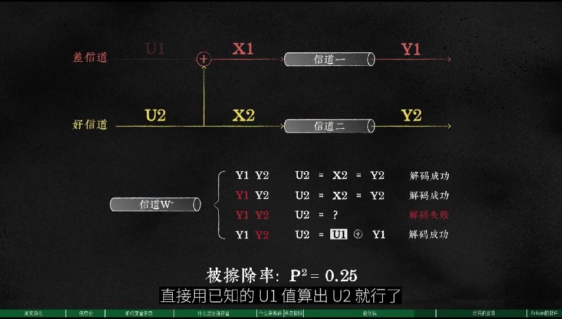

- 今天还是什么都没干，有点无聊，也不知道自己心里在想什么东西
- 社恐是真滴难
- 攒了好多文章都没有看，我该怎么办呢？我感觉我的效率太低了，不知道为什么会这样
	- > 我觉得应该用【番茄钟】，但我又不能养成习惯
## 极化码的基本原理
- 原理图
	- 
- 其中U1已知，~~那么Y1照理说应该为U1~~。
	- ~~**!!!应该的意思是，随机选择其中一种方式解码，那么正确的概率是75%！不是说让你通过不同的情况，挑一种，因为你无法知道Y1、Y2是否正确被传输了**~~
- 1.~~关于信息传输的正确率。在17：05里面呈现了选择好信道时出现的4种情况，我想了下，因为最终你不知道这两条信道到底有没有正确的传过来，所以没法对应情况进行计算，实际上是【随机】选择四种解码方法中的一种，从而正确概率是75%? 是这样吗？~~ **PBE管道只要传输成功，就是正确的！！！**也就是说可以以C确保一个正确率P，但是通过极化码的方式可以以C-的速率保证100%的正确率。
- 2.关于香农极限。~~我粗浅的理解啊，比如说给定一条信道是固定P的概率，在多次传输信息后，不能推得你最终获得获得的信息正确率是P，因为这个P只体现在无穷次的传输中，而且在这种情况下你就不知道你自己获得的信息到底哪个是真的哪个是假的。其实想一想这个问题就好，假设一条信道正确率是1%，请问如何保证传过去的信息是正确的，即使重复传很多次也不能保证，所以需要设定机制来保证接收到信息是正确的。而香农极限就可以保证，即使需要浪费许多条坏信道，可以保证传过去的信息是对的。~~维基百科的定义“换句话说，当讯号传输速率尚未达到香农极限时，可以找到零错误率的编码方法。”也就是说可以将信道的质量转嫁到信道数量上，以此保证信道传输的正确。
- 比如说设定一个概率50%，每条线路单独传，最后概率还是50%，没有变。但是将两个信道组合起来，就可以达到75%，不断的累加以确保100%。
	- 但这仅仅是保证了正确率，但会降低速度，最终有一个最优解，使得正确率在100时，速率最高为C。这就是极化码的作用。
	- > 最简单的提高正确率的方法，两个bit为一对，原有概率为10%，结合后的概率为1-0.9^2=19%，可见极化码的效率之高