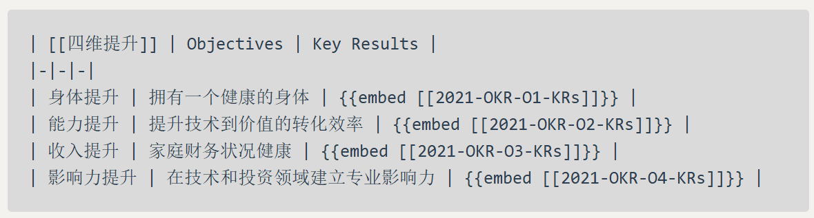

# EDG夺冠了！！
## 一种Logseq表格的使用方式
	- ## embed？？
	  background-color:: #497d46
	- 
	- 
- For those wondering where things **stand with** Logseq Mobile, we do have a bit of an update #英语
- DONE [#A] research balalah is a top priority
- 设置为DOING的时候自动会开始计时
- 做读书笔记需要有NOTES，就是用自己的话描述书中提及的问题 #费曼学习法 #学习
  background-color:: #497d46
- 语法：underline #logseq教程
  background-color:: #793e3e
- Advanced commands start with < and when selected expand a BEGIN...END section inside a block. There can be multiple BEGIN...END sections in a block. #logseq教程
	- #+BEGIN_QUOTE
	  引用
	  #+END_QUOTE
	- ``` 这里是标题
	  下面是文字
	  
	  ```
	- #+BEGIN_CENTER
	  这个是居中
	  #+END_CENTER
	- #+BEGIN_VERSE
	  这是啥
	  **保留换行符**
	  #+END_VERSE
	- 隐藏的评论 
	  background-color:: #497d46
	  collapsed:: true
	  #+BEGIN_COMMENT
	  测试
	  #+END_COMMENT
-
- 人应该是从喜欢里得到力量和快乐，而不是花光了所有力量和快乐去喜欢。 #句子
- [[符号链接、硬链接及其在 Windows 上的应用举例]]
	- DONE 复习
	  :LOGBOOK:
	  CLOCK: [2021-11-22 Mon 22:45:29]--[2021-11-22 Mon 22:45:29] =>  00:00:00
	  CLOCK: [2021-11-22 Mon 22:45:30]--[2021-11-22 Mon 22:45:31] =>  00:00:01
	  CLOCK: [2021-11-22 Mon 22:45:31]--[2021-11-22 Mon 22:45:32] =>  00:00:01
	  :END:
	-
-
- DONE 明天复习全部