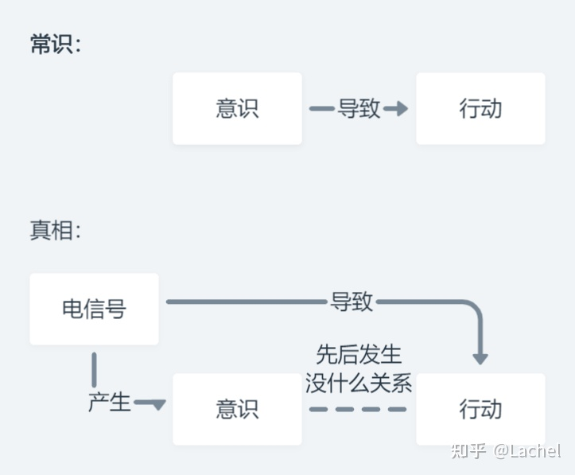

- [[如何做选择]]
  heading:: true
- [[匈牙利政治剧变的原因]]
  heading:: true
- ## 自由意志
	- 有一种中间观点，认为过去会限制，不会决定，个人的选择是众多结果中的其中一种，虽被过去影响但不由过去决定，即便行动者是自由在各种选择中行使意志，行动者仍然不是其行动唯一的起因，因为没有人能做不可能的动作，例如挥动手臂来飞行。应用在精神状态，这个观点提倡一个人可以选他可以想到的选项，但不能选从未进入他脑海的选项，从这个观点看，现在做的选择可能会开启、决定、或局限未来的选择。
	- 神经科学家Benjamin Libet做过一系列的实验，他发现：早在参与者产生一个[想法]之前，参与者的大脑中就会产生一个电信号的波峰。通过这个波峰，他可以提前预测参与者接下来会做什么。（Libet et al，1983）
	- 比如：2008年，韩国科学家Chun Siong Soon做了一系列实验。他们利用fMRI（一种现代常见的脑成像技术）检测参与者的大脑活动，并让参与者完成按按钮的任务。结果发现：
	  通过大脑活动的监测，研究人员可以确切预测：参与者将于何时按下哪个按钮。（Chun Siong Soon et al，2008）。也就是说：早在参与者[决定按下按钮]的若干秒前，其大脑就已经发出了相关的信号。与其说参与者是自己按下按钮，不如说是被这个信号支配，按下按钮。
	- 
	- 打个比方：我们的意识，就像一个皇帝。看似他在风光地发号施令，但实际上，在他背后还有一个影子内阁，所有的决策都是他们作出的，经由皇帝之手发布出去，皇帝只不过是他们的一个传声筒。
	- 这个「缺水]的电信号是怎么来的呢？不难想象，它是身体通过对自己整个状态的监测，发现
	  [啊，好像有点缺水]，于是向大脑发出这个信号。
	  然后大脑再把这个信号一分为二：一条路径驱动我们的身体起来倒水，另一条路径告诉我们的意识：身体缺水了，我需要喝点水，所以告诉你一声。
	- > 这个电位和意识已经有完全的区别的，你以为是自己按照逻辑在考虑，实际上你的逻辑已经被电位决定了，但电位是不是被另外一个东西决定的，我们不知道。
	- #+BEGIN_IMPORTANT
	  甚至，你连缺水的状态都是已经被设定好的，其实缺水和你喝水只是刚好同时发生了而已？？
	  #+END_IMPORTANT
	- 我的观点其实很简单：哪怕决定论是真的，一切都是被决定好了的，其实对我们也没什么影响。原因很简单：即使一切都是决定了的，但是我们并不知道——那么对于我们来说，是否被决定，又有什么关系呢？就像看电影。一部电影的结尾当然是早就拍好了的，但你会因为这一点就不去看电影吗？当然不会。对我们来说，享受这个过程，并不断去思考、体验，才是最重要的。
	  background-color:: #787f97