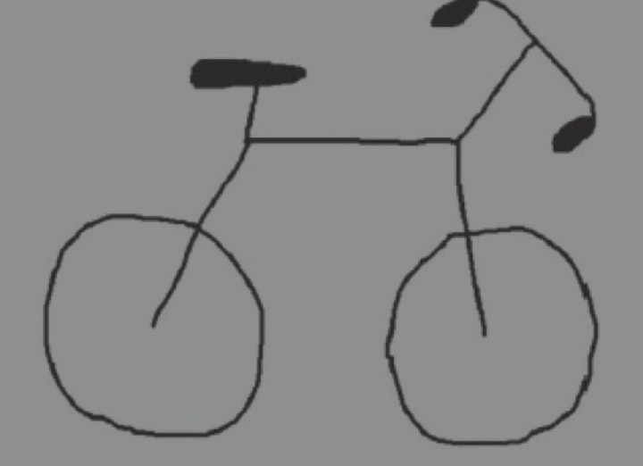

- 解释性深度错觉（illusion of explanatory depth，简称IoED）的测试
  heading:: true
	- 
	- 现在我们再做一个实验：请把下图中的自行车缺少部分补全。
	- 你的补全是什么样子的？
	- 利物浦大学的心理学家丽贝卡·劳森（Rebecca Lawson）向一组心理学专业的本科生测试的时候，将近一半的学生无法完全正确地补全图片（下图是部分结果）。就上面的测试，如弗兰克·凯尔所言，“许多受试者反馈说当他们得知自己远比原先预想的要无知时，一份实实在在的惊讶和从未有过的谦卑涌上心头”。
	- 我们能说明白、讲清楚的知识确实比自以为的要有限。此乃解释性深度错觉之本质。我们发现错觉不仅发生在对日常物品的认知上，它几乎无处不在：人们高估了自己对诸如国家政策和对外关系之类政治议题的理解，在热门科学话题如转基因作物和气候变化方面也全凭想当然，甚至连个人理财都是一本糊涂账。 #句子
	  background-color:: #497d46