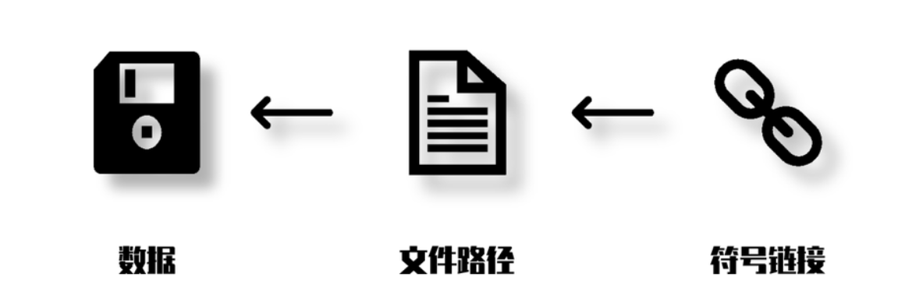

- Created Time： [[2021-11-07]]
- DONE 复习明天
  :LOGBOOK:
  CLOCK: [2021-11-22 Mon 22:41:48]--[2021-11-22 Mon 22:44:39] =>  00:02:51
  :END:
## 用处
	- 用云盘保存那些不方便改变位置的文件
	- 实现更省空间的增量备份
	- ## 符号链接的原理
		- 
		- **符号链接**像一个虫洞：当用户或应用要访问此虫洞时，就会被传送到符号链接所指向的地方，**但他们是通过虫洞访问此目标的，所以其路径仍是虫洞自己的路径**，这是它和快捷方式在效果上的区别所在。
		  > 符号链接的名称或者后缀丝毫不会影响到其目标。如果有一个图片 cats.jpg，我为它创建一个叫做 cats.docx 的符号链接，双击 cats.docx 时，仍然会出现一个图片。
	- ## 符号链接的特性
		- **所做的一切更改都会反映在目标上**。因为打开符号链接，就是打开了目标。**复制符号链接，会复制目标的内容**；移动符号链接，则会移动链接本身。
		- **更改目标的名称，移动目标的位置，符号链接将会成为死链**，因为它无法通过设定的路径找到目标；更改符号链接本身的名称和位置，目标不受影响。
		- 当目标被删除时，符号链接继续存在，但会成为死链，无法打开。当符号链接被删除时，它指向的目标不受影响。
	- ## 硬链接的原理
		- #+BEGIN_NOTE
		  符号链接是指向目标**路径**的链接，而硬链接则是指向**目标数据对象**的链接。
		  #+END_NOTE
		- 因为一个卷中的数据对象都有一个独一无二文件 ID，也可以说**硬链接是指向目标文件 ID 的链接**。（硬链接指向本质，符号链接指向名字）
		- 不难发现，硬链接和前面对文件的定义是一样的，原因在于，同一个文件 ID 可以对应很多不同的文件路径。这些不同的文件都可以被称为硬链接。这也是为什么在第一节中说「文件管理器上的几乎所有文件都可以被称为硬链接」。
		  > 其实文件本身也就是一个硬链接， <ins>【硬链接相当于一个人的不同名字】</ins>
		- 
		- 因为他们数据是相通的，两个硬链接，所有属性都相同，更改其中一个文件的内容，另一个也会随之变化。
		- 由于不同的文件指向的是同样的数据，所以无论给同一个文件创建多少个硬链接，他们占整个卷的数据大小都是一样的。下图中，当 C 盘只有一个大小为 4 G 的 ISO 文件时，剩余大小为 373 GB；我为此 ISO 创建了另外 4 个 硬链接之后，卷的剩余大小并不因此而变化，尽管属性界面显示他们为 20 GB。
	- ## 硬链接的特性：
		- 它必须指向本地的同一个卷内存在的文件，在 C 盘创建硬链接只能指向 C 盘存在的文件。因为只有在同一个卷内，文件 ID 才是独一无二的。
		- **更改目标文件的名称、位置，硬链接不会受到影响。更改硬链接的名称、位置，目标文件不受影响，链接不会断开。因为改名，移动都不会改变文件 ID。**
		  > 相当于一个人有两个名字，其实改了一个名字对另一个毫无影响，因为人没有变。
		- background-color:: #264c9b
		  #+BEGIN_NOTE
		  **当目标被删除时，硬链接继续存在**，且可以正常打开、编辑。因为他具备一个完整的文件结构。当硬链接被删除时，目标文件继续存在，不受影响。只有当一个文件 ID 对应的所有硬链接被删除时，数据才真正被标记为删除。
		  #+END_NOTE
	- ## 命令行创建链接
		- > New-Item [链接名称] -Itemtype SymbolicLink/HardLink -Target [目标绝对路径]
		- 安装 [linkshellextension](https://schinagl.priv.at/nt/hardlinkshellext/hardlinkshellext.html)
	- ## 链接的使用
		- 使用 OneDrive 实时保存微信重要文件
		  heading:: true
			- 举例来说，Windows 版微信会在文档中创建 WeChat Files 文件夹，其中有一个 File 目录包含了聊天中的已下载的各类文件，这个文件夹正是既重要又不太方便移动。
			- **而符号链接可以让任何文件夹以任何名称出现在另一个地方**，我们为此文件夹在 OneDrive 内创建一个符号链接，OneDrive 访问此链接时会被引导到微信的 File 文件夹内，其中的内容就会被全部上传到云端。
			- #+BEGIN_VERSE
			  这样做了之后，在本地打开 File 符号链接时，会展现微信文件夹中的数据。而在 OneDrive 云端上，Files 则被视作一个正常的文件夹。还可以用类似的方法备份 QQ 的接收文件夹，Windows Appdata 中的一些设置文件等等。需要注意的是，当目标文件删除或消失时，OneDrive 也删除你的备份。
			  
			  **我们还可以考虑将上面的过程反过来**！将目标文件或目录放在 OneDrive 中，在需要的程序文件夹中创建符号链接。在上面的例子中，即在 OneDrive 中放一个 File 文件夹，把微信中的 File 数据移动到此文件夹中，然后在微信的 FileStorage 中创建以 OneDrive 的 File 为目标的符号链接。
			  
			  这种做法好处是：程序卸载时只要提前将符号链接删除，就不必担心重要的文件会被卸载程序清除掉
			  #+END_VERSE
		- DeLorean Copy 实现增量备份
		  heading:: true
		- ## DONE 符号链接的硬链接的区别？